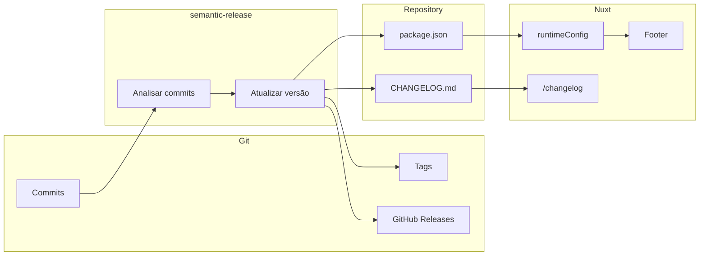

```mermaid
flowchart LR

    subgraph Git
        A["Commits"]
        B["Tags"]
        C["GitHub Releases"]
    end

    subgraph semantic-release
        D["Analisar commits"]
        E["Atualizar versão"]
    end

    subgraph Repository
        F["package.json"]
        G["CHANGELOG.md"]
    end

    subgraph Nuxt
        H["runtimeConfig"]
        I["Footer"]
        J["/changelog"]
    end

    A --> D

    D --> E

    E --> F
    E --> G
    E --> B
    E --> C

    F --> H

    H --> I

    G --> J
```