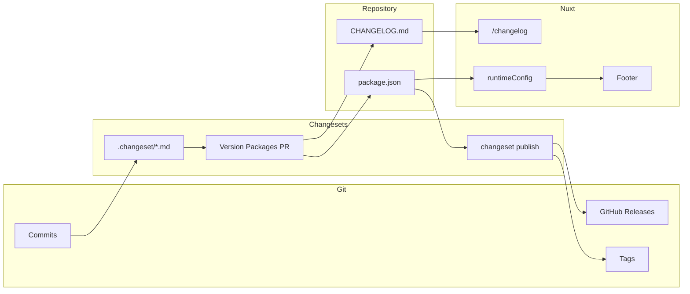

```mermaid
flowchart LR

    subgraph Git
        A["Commits"]
        B["Tags"]
        C["GitHub Releases"]
    end

    subgraph Changesets
        D[".changeset/*.md"]
        E["Version Packages PR"]
        F["changeset publish"]
    end

    subgraph Repository
        G["package.json"]
        H["CHANGELOG.md"]
    end

    subgraph Nuxt
        I["runtimeConfig"]
        J["Footer"]
        K["/changelog"]
    end

    A --> D

    D --> E

    E --> G
    E --> H

    G --> F

    F --> B
    F --> C

    G --> I

    I --> J

    H --> K
```
