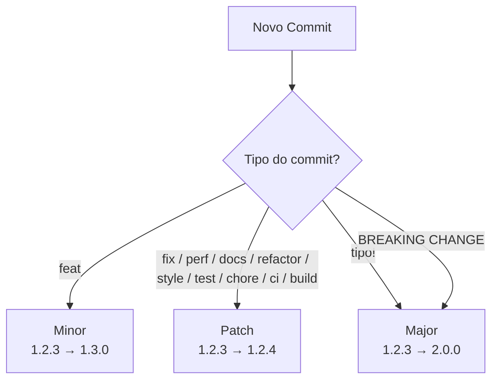

# Convenção de commits

Este projeto usa Conventional Commits para calcular automaticamente a próxima versão com Semantic Versioning.

## Formato

```text
tipo(escopo opcional): mensagem curta no imperativo
```

Exemplos:

```text
feat(projects): adiciona novo projeto
fix(header): corrige navegação mobile
docs(readme): atualiza instalação
refactor(footer): simplifica estrutura
chore(deps): atualiza dependências
```

## Tipos aceitos

| Tipo | Versão | Uso |
| --- | --- | --- |
| `feat` | minor | Nova funcionalidade |
| `fix` | patch | Correção de bug |
| `perf` | patch | Melhoria de performance |
| `refactor` | patch | Refatoração sem mudança de comportamento |
| `docs` | patch | Documentação |
| `style` | patch | Formatação ou estilos sem mudança funcional |
| `test` | patch | Testes |
| `chore` | patch | Tarefas de manutenção |
| `ci` | patch | Integração contínua |
| `build` | patch | Build, empacotamento ou dependências de build |

Commits com `!` ou rodapé `BREAKING CHANGE:` geram uma versão major.

```text
feat!: altera a estrutura principal do projeto
```

```text
feat(api): muda contrato público

BREAKING CHANGE: remove suporte ao formato antigo de resposta.
```

## Fluxo de versionamento


