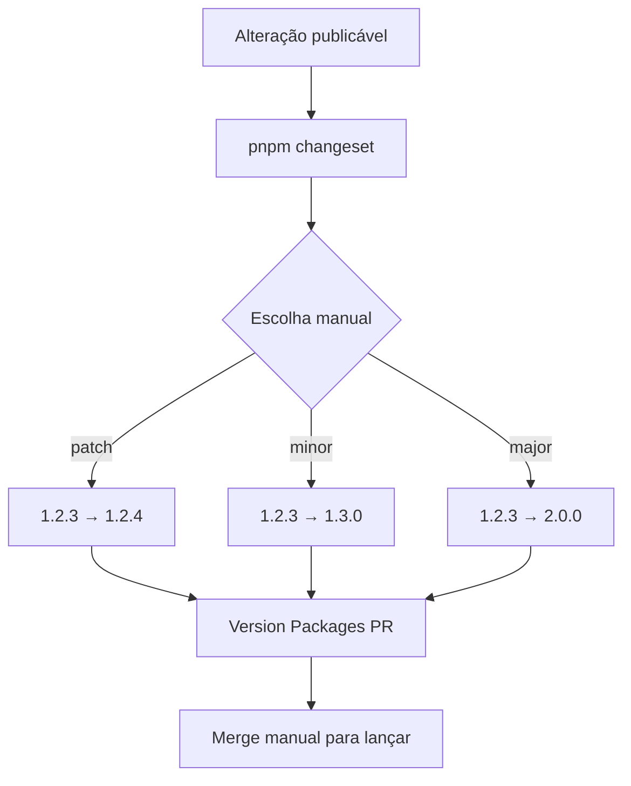

# Changesets

Este projeto não usa commits para calcular versões automaticamente.

Commits comuns podem ter qualquer formato e nunca criam release por si só. Uma alteração só entra em uma futura release quando um changeset é criado manualmente.

## Criar uma alteração publicável

```text
pnpm changeset
```

Ao criar o changeset:

- escolha manualmente `patch`, `minor` ou `major`;
- escreva a descrição pública que deve aparecer no `CHANGELOG.md`;
- commite o arquivo `.changeset/*.md` junto com a alteração.

Exemplo:

```md
---
"my-portfolio": minor
---

✨ Feature: adiciona uma página pública de changelog.
```

## Padrão visual das descrições

Use o ícone como parte manual da descrição do changeset:

- ✨ Feature: nova funcionalidade
- 🐛 Correção: correção de bug
- ⚡ Performance: melhoria de performance
- ♻️ Refatoração: reorganização interna
- 📝 Documentação: documentação
- 💄 Interface: ajuste visual
- ✅ Testes: cobertura ou ajuste de testes
- 🔧 Manutenção: configuração ou manutenção
- 👷 CI: integração contínua
- 📦 Build: build ou empacotamento
- 💥 Breaking change: mudança incompatível

## Fluxo de versionamento


