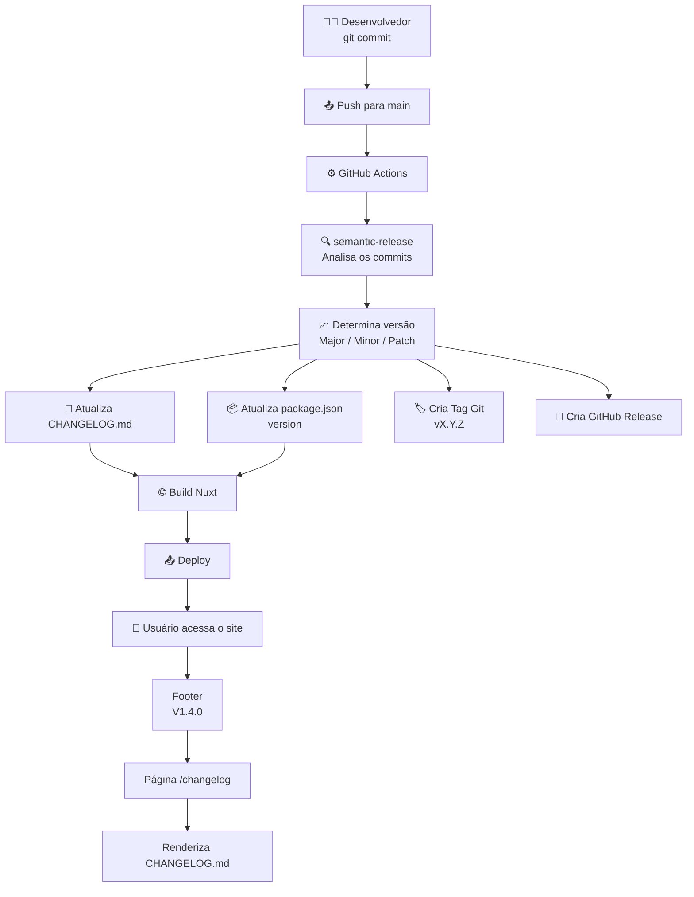

# Fluxo de release

## Implementação

- `release.config.cjs` define as regras de Semantic Versioning, o formato do changelog e os plugins do semantic-release.
- `.github/workflows/release.yml` executa o release em pushes para `main`, com `fetch-depth: 0` para preservar histórico e tags.
- `package.json` é a fonte da versão exibida no frontend.
- `nuxt.config.ts` expõe `package.json.version` em `runtimeConfig.public.appVersion`.
- `app/components/layout/AppFooter.vue` exibe o link interno `Vx.y.z` para `/changelog`.
- `app/pages/changelog.vue` renderiza o `CHANGELOG.md` real, sem duplicar o conteúdo em TypeScript.
