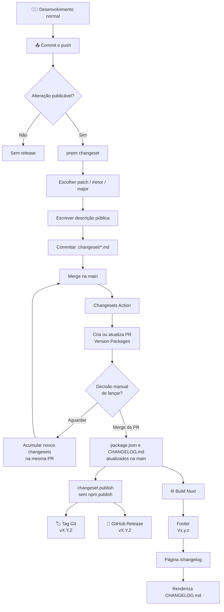

# Fluxo de release

## Implementação

- `.changeset/config.json` define o Changesets como fonte do versionamento manual.
- `.github/workflows/release.yml` usa `changesets/action` para manter a PR `Version Packages`.
- `pnpm changeset` cria um arquivo `.changeset/*.md` com o tipo de versão e a descrição pública.
- `pnpm version` executa `changeset version` e atualiza `package.json`, `pnpm-lock.yaml` e `CHANGELOG.md` na PR de versão.
- `pnpm release` executa `changeset publish`; como o pacote é `private: true`, nada é publicado no npm, mas `privatePackages.tag: true` permite a criação da tag `vX.Y.Z`.
- `package.json` é a fonte da versão exibida no frontend.
- `nuxt.config.ts` expõe `package.json.version` em `runtimeConfig.public.appVersion`.
- `app/components/layout/AppFooter.vue` exibe o link interno `Vx.y.z` para `/changelog`.
- `app/pages/changelog.vue` renderiza o `CHANGELOG.md` real, sem duplicar o conteúdo em TypeScript.
